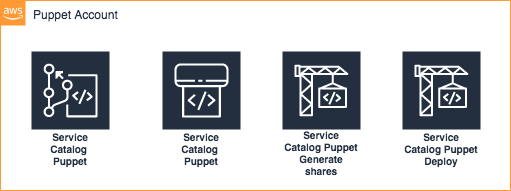

Getting up and running
======================

ServiceCatalog-Puppet runs in your AWS Account.  In order for you to install it into your account you can use the 
aws-service-catalog-puppet cli.  This is distributed via [PyPi](https://pypi.org/project/aws-service-catalog-puppet/)


## What am I going to install?
ServiceCatalog-Puppet is bootstrapped from your local machine.  You install a command line utility that will provision
the resources you need into your AWS Account.  Once you have completed the bootstrap you will have the following pipeline
in your account:


using the following services:




## Before you install
You should consider which account will be the home for your puppet.  This account will contain the AWS CodePipelines
and will need to be accessible to any accounts you would like to share with.  If you are using ServiceCatalog-Factory,
we recommend you install both tools into the same account. 
 

## Installing the tool
This is a python cli built using Python 3.

It is good practice to install Python libraries in isolated environments.  You can create the a virtual environment using
the following command:

```bash
virtualenv --python=python3.7 venv
source venv/bin/activate
```

Once you have decided where to install the library you can install the package:
```bash
pip install aws-service-catalog-puppet
```

This will install the library and all of the dependencies.

## Setting it up
The Puppet will run in your account and needs some configuration.  You will need to stand up the puppet and set up the 
configuration for it to run smoothly.

You will also need to provision an IAM Role within the _spoke_ accounts - those you want to provision products in.

### Bootstrap your spokes
You will need to bootstrap each of your spokes.  In order to do so please export your credentials and then run:
```bash
servicecatalog-puppet bootstrap-spoke <ACCOUNT_ID_OF_YOUR_PUPPET>
```

### Bootstrap your account

There are two or threes parts to bootstrapping the puppet.  

#### Setting up your global configuration
The first is concerned with setting the global configurations.  
To do this we use AWS SSM Parameters.  To get setup you need to create a configuration file with a list of regions you want to 
use - for example config.yaml:

```yaml
regions: [
  'us-east-2',
  'us-east-1',
  'us-west-1',
  'us-west-2',
  'ap-south-1',
  'ap-northeast-2',
  'ap-southeast-1',
  'ap-southeast-2',
  'ap-northeast-1',
  'ca-central-1',
  'eu-central-1',
  'eu-west-1',
  'eu-west-2',
  'eu-west-3',
  'sa-east-1',
]
```
Once you have this file you need to upload the config:
```bash
servicecatalog-puppet upload-config config.yaml
```

If you make changes to this you will need to run upload-config and bootstrap commands again for the changes to occur.

Once that has completed you are ready to bring up the rest of the puppet.

#### Setting to to use AWS Organizations
The second part to bootstrapping is optional.  If you would like to use AWS Organizations features in your manifest file 
you will need to set which IAM Role should be used to perform these actions.  In order to do this you will need to run 
the following:

```bash
servicecatalog-puppet set-org-iam-role-arn arn:aws:iam::0123456789010:role/Admin  
```

Please replace 0123456789010 with the master account id you want to use.  Please note this IAM Role needs the following 
IAM Policy:

```yaml
PolicyDocument:
  Version: 2012-10-17
  Statement:
    - Effect: Allow
      Action:
        - organizations:ListRoots
        - organizations:DescribeAccount
        - organizations:ListOrganizationalUnitsForParent
        - organizations:ListChildren
      Resource: '*'
```

Once you have run that command you are ready for the final stage.

#### Configuring your puppet
Create the AWS CodeCommit repo and AWS CodePipeline resources to run the puppet for your 
master account:
```bash
servicecatalog-puppet bootstrap
``` 

### Setup your puppet
Clone the configuration repo and configure your factory by editing the ```manifest.yaml``` file:
```bash
git clone --config 'credential.helper=!aws codecommit credential-helper $@' --config 'credential.UseHttpPath=true' https://git-codecommit.eu-west-1.amazonaws.com/v1/repos/ServiceCatalogPuppet
servicecatalog-puppet seed simple ServiceCatalogPuppet
cd ServiceCatalogPuppet
vim manifest.yaml
git add .
git commit -am "initial add"
git push
```
Wait for pipeline to complete and you have a working puppet.